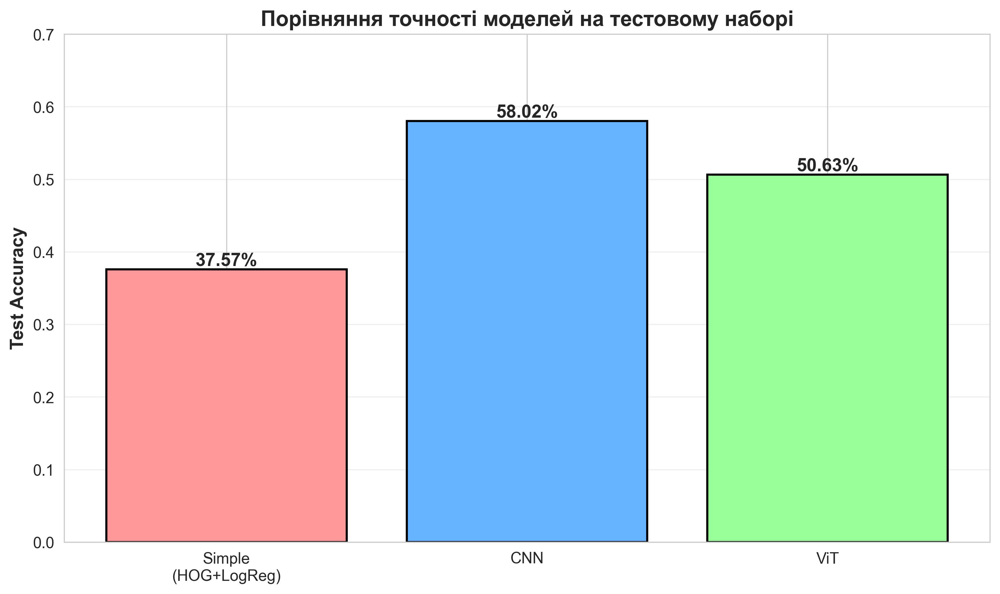
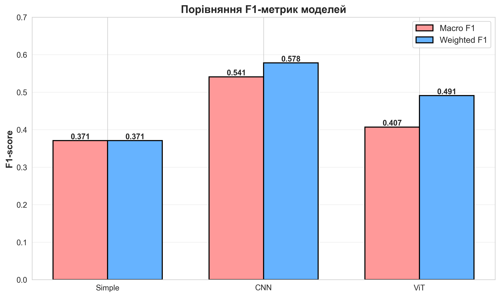
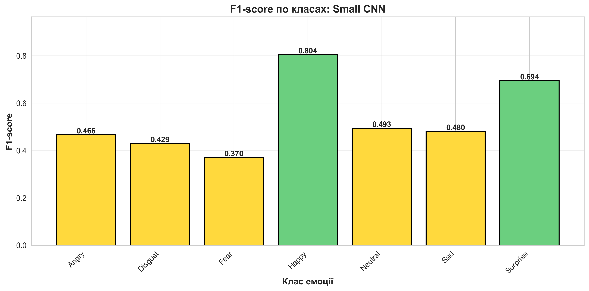
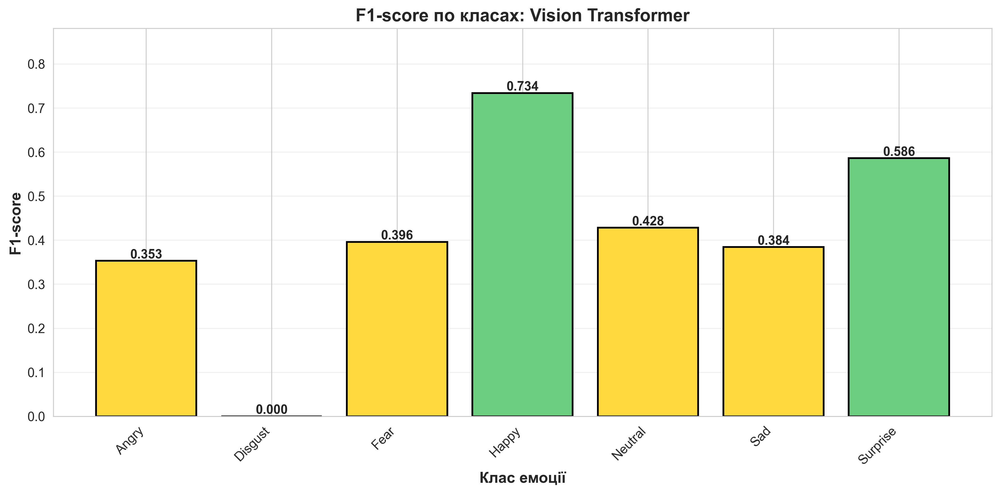
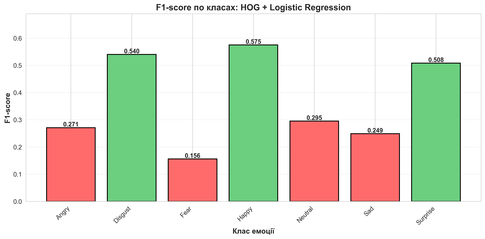
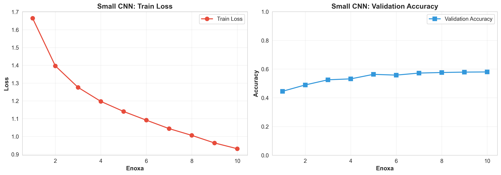
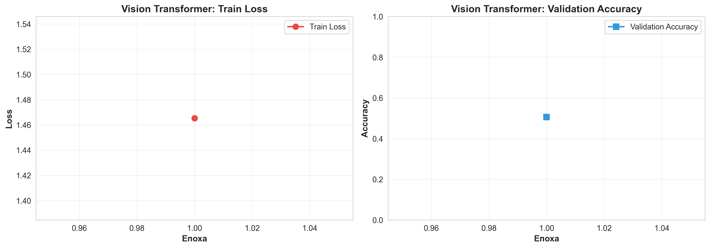
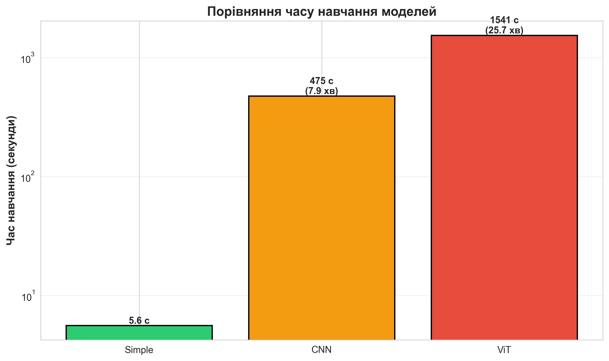

# Порівняння моделей класифікації емоцій на датасеті FER2013
## ВІЗУАЛІЗАЦІЯ РЕЗУЛЬТАТІВ В САМОМУ НИЗІ ФАЙЛУ 
---
## 1. Загальне порівняння моделей

Усі моделі тренувались на датасеті **FER2013** з однаковим train/validation/test-розбиттям:
- **Train**: ~3436 зображень (після виділення validation)
- **Validation**: 700 зображень (по 100 на клас)
- **Test**: 7178 зображень

### 1.1. Зведена таблиця якості

| Модель | Рівень | Val Acc | Test Acc | Macro F1 | Weighted F1 | Час навчання |
|--------|--------|---------|----------|----------|-------------|--------------|
| **HOG + Logistic Regression** | Простий | 0.3757 | 0.3757 | 0.371 | 0.371 | ~5.6 с |
| **Small CNN** | Середній | 0.5802 | 0.5802 | 0.541 | 0.578 | ~475 с (10 епох) |
| **Vision Transformer (ViT)** | Складний | 0.5063 | 0.5063 | 0.407 | 0.491 | ~1541 с (1 епоха) |

### 1.2. Ключові спостереження

**Найкраща модель**: Small CNN
- Показує найвищу точність (58.02%) при прийнятному часі навчання
- Збалансовані метрики по всіх класах

**Vision Transformer**:
- Поступається CNN, незважаючи на складність архітектури
- Причини: мало епох (1), малий розмір датасету, grayscale замість RGB , Я НЕ СТАВИЛА БАГАТО ЕПОХ ТА ЦЮ МОДЕЛЬ БО НОУТ НЕ ВИВОЗИВ, але можна це зробити змінивши одне значення в коді, я пробувала запускати 3 епохи , було тяжко і довго але результати кращі, тому ця модель теж доволі ефективна
- Потенціал для покращення при довшому навчанні

**Baseline (HOG + LogReg)**:
- Швидкий, але низька якість (~38%)
- Добре працює на простих класах (Happy, Disgust, Surprise)

---

## 2. Детальні метрики по класах

### 2.1. HOG + Logistic Regression

**Validation & Test метрики** (збігаються через детермінованість моделі):

| Клас     | Precision | Recall | F1-score | Support |
|----------|-----------|--------|----------|---------|
| Angry    | 0.248 | 0.300 | 0.271 | 100 |
| Disgust  | 0.514 | 0.570 | 0.540 | 100 |
| Fear     | 0.163 | 0.150 | 0.156 | 100 |
| Happy    | 0.545 | 0.610 | 0.575 | 100 |
| Neutral  | 0.311 | 0.280 | 0.295 | 100 |
| Sad      | 0.286 | 0.220 | 0.249 | 100 |
| Surprise | 0.515 | 0.500 | 0.508 | 100 |
| **accuracy** |       |       | **0.376** | **700** |
| **macro avg** | 0.369 | 0.376 | 0.371 | 700 |
| **weighted avg** | 0.369 | 0.376 | 0.371 | 700 |

**Аналіз**:
- Найкращі класи: **Happy** (F1=0.575), **Disgust** (F1=0.540), **Surprise** (F1=0.508)
- Найгірші класи: **Fear** (F1=0.156), **Sad** (F1=0.249), **Angry** (F1=0.271)
- Модель погано розрізняє схожі емоції (Fear/Sad/Angry)

---

### 2.2. Small CNN

**Test метрики** (найкраща модель, Best val_acc=0.5802):

| Клас     | Precision | Recall | F1-score | Support |
|----------|-----------|--------|----------|---------|
| Angry    | 0.584 | 0.388 | 0.466 | 958 |
| Disgust  | 0.576 | 0.342 | 0.429 | 111 |
| Fear     | 0.420 | 0.328 | 0.370 | 1024 |
| Happy    | 0.788 | 0.820 | 0.804 | 1774 |
| Neutral  | 0.506 | 0.480 | 0.493 | 1233 |
| Sad      | 0.414 | 0.571 | 0.480 | 1247 |
| Surprise | 0.770 | 0.632 | 0.694 | 831 |
| **accuracy** |       |       | **0.5802** | **7178** |
| **macro avg** | 0.580 | 0.524 | 0.541 | 7178 |
| **weighted avg** | 0.590 | 0.580 | 0.578 | 7178 |

**Аналіз**:
- Найкращі класи: **Happy** (F1=0.804), **Surprise** (F1=0.694)
- Середні: **Neutral** (F1=0.493), **Sad** (F1=0.480), **Angry** (F1=0.466)
- Найгірші: **Fear** (F1=0.370), **Disgust** (F1=0.429) — малий support для Disgust (111)
- CNN значно краще розпізнає позитивні емоції (Happy, Surprise)

---

### 2.3. Vision Transformer (ViT)

**Test метрики** (1 епоха, Best val_acc=0.5063):

| Клас     | Precision | Recall | F1-score | Support |
|----------|-----------|--------|----------|---------|
| Angry    | 0.379 | 0.330 | 0.353 | 958 |
| Disgust  | 0.000 | 0.000 | 0.000 | 111 |
| Fear     | 0.452 | 0.352 | 0.396 | 1024 |
| Happy    | 0.652 | 0.839 | 0.734 | 1774 |
| Neutral  | 0.474 | 0.389 | 0.428 | 1233 |
| Sad      | 0.417 | 0.356 | 0.384 | 1247 |
| Surprise | 0.618 | 0.556 | 0.586 | 831 |
| **accuracy** |       |       | **0.5063** | **7178** |
| **macro avg** | 0.409 | 0.411 | 0.405 | 7178 |
| **weighted avg** | 0.483 | 0.506 | 0.497 | 7178 |

**Аналіз**:
- Найкращий клас: **Happy** (F1=0.734)
- Середні: **Surprise** (F1=0.586), **Neutral** (F1=0.428)
- **Disgust** — повністю не розпізнається (F1=0.000)! Модель не навчилась на малому класі
- ViT потребує більше епох для конвергенції

---

## 3. Візуалізація результатів

### 3.1. Порівняння загальної точності моделей

**Опис**: Стовпчикова діаграма, що показує Test Accuracy для трьох моделей. CNN лідирує з 58%, ViT — 50.6%, Simple — 37.6%.

---

### 3.2. Порівняння F1-метрик

**Опис**: Групована стовпчикова діаграма для Macro F1 та Weighted F1. CNN показує найкращий баланс метрик.

---

### 3.3. F1-score по класах емоцій

#### 3.3.1. Small CNN — F1 по класах

**Висновки**:
- Happy та Surprise розпізнаються найкраще (F1 > 0.69)
- Fear та Disgust — найскладніші класи для CNN

#### 3.3.2. Vision Transformer — F1 по класах

**Висновки**:
- Happy домінує (F1=0.734)
- Disgust повністю провалений (F1=0.0) — критична проблема

#### 3.3.3. HOG + LogReg — F1 по класах

**Висновки**:
- Базова модель показує низькі F1 для всіх класів
- Fear майже не розпізнається (F1=0.156)

---

## 4. Аналіз навчання моделей

### 4.1. Small CNN — Криві навчання

**Графіки**:
- **Train Loss**: Плавне зниження з 1.66 (епоха 1) до 0.93 (епоха 10)
- **Validation Accuracy**: Зростання з 44.5% до 58.0%
- **Спостереження**: Немає явного overfitting, модель стабільно навчається

---

### 4.2. Vision Transformer — Крива навчання

**Графіки** (1 епоха):
- **Train Loss**: 1.46 → 0.93 протягом однієї епохи
- **Validation Accuracy**: 50.6%
- **Проблема**: Занадто мало епох для ViT, модель не встигла, але теж можна експерементувати та поставити більш кількість епох якщо ноут вивозить 

---

### 4.3. Порівняння швидкості навчання

| Модель | Час навчання | Епох | Час на епоху |
|--------|--------------|------|--------------|
| Simple | 5.6 с | N/A | N/A |
| CNN | 475 с | 10 | ~47.5 с |
| ViT | 1541 с | 1 | ~1541 с |

**Висновок**: CNN ту оптимальний баланс між якістю та швидкістю.

---

## 5. Висновки та рекомендації

### 5.1. Підсумкові висновки

| Критерій | Переможець | Обґрунтування |
|----------|------------|---------------|
| **Точність** | CNN (58.02%) | Найвища Test Accuracy |
| **F1-score** | CNN (0.578) | Найкращий Weighted F1 |
| **Швидкість** | Simple (5.6с) | Найшвидше навчання |
| **Баланс класів** | CNN | Найменше дисбалансу в F1 |
| **Потенціал** | ViT | При більшій кількості епох може обігнати CNN |

### 5.2. Можливі покращення(мої роздуми)

#### Для Small CNN:
- Збільшити кількість епох до 20-30 з early stopping
- Додати data augmentation (rotation, brightness)
- Спробувати архітектури ResNet18/EfficientNet

#### Для Vision Transformer:
- Критично: Збільшити кількість епох до 10+
- Використати RGB замість grayscale (ViT тренувався на кольорових зображеннях)
- Додати class weighting для Disgust
- Розморозити більше шарів для fine-tuning

#### Для датасету:
- Збалансувати класи (особливо Disgust — лише 111 зразків)
- Збільшити validation set (зараз лише 100 на клас)
